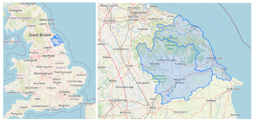
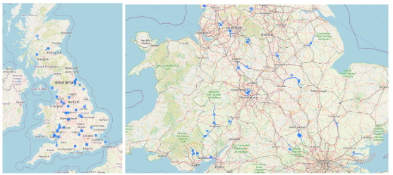

# IF4040_SpatialDatabase
Spatial Database exploration and implementation

## Table of Contents
* [Program Description](#program-description)
* [Data Details](#data-details)
* [Visualization](#visualization)
* [Team Members](#team-members)
* [References](#references)


## Deskripsi Singkat 
This program contains the implementation of spatial database using PostgreSQL and PostGIS. The dataset used in this project is earthquake dataset in United Kingdom, UK's road and rail road dataset, and UK's administrative units.

## data Details
| No. | Relation | Shape | Source | 
|-----|--------------------|------------|--------|
| 1 | Countries | (4, 4) | [OpenDataSoft](https://public.opendatasoft.com/explore/dataset/georef-united-kingdom-country/) |
| 2 | Regions | (12, 5)| [OpenDataSoft](https://public.opendatasoft.com/explore/dataset/georef-united-kingdom-region/table/) |
| 3 | Districts | (374, 5) | [OpenDataSoft](https://public.opendatasoft.com/explore/dataset/georef-united-kingdom-local-authority-district/) |
| 4 | Roads | (41460, 4)| [OpenDataSoft](https://public.opendatasoft.com/explore/dataset/europe-road/table/?refine.icc=GB) |
| 5 | Rails | (8477, 4) | [OpenDataSoft](https://public.opendatasoft.com/explore/dataset/europe-rail-road/export/?refine.icc=GB) |
| 6 | Earthquakes | (3003, 9) | [BritishGeologicalSurvey](https://earthquakes.bgs.ac.uk/earthquakes/dataSearch.html) |

## Visualization
Here are some visualizations of queries related to spatial database.
```
SELECT 
    DISTINCT d.district_name, 
	ST_COLLECT(e.point::geometry, d.shape::geometry)
FROM 
    Earthquakes e
JOIN 
    Districts d
ON 
    ST_Contains(d.shape::geometry, e.point::geometry)
WHERE 
    e.depth > 30;

```

```
SELECT 
    e.id, 
    r.id AS road_id, 
    ST_COLLECT(e.point::geometry, r.line::geometry)
FROM 
    Earthquakes e
JOIN 
    Rails r
ON 
    ST_DWithin(r.line::geometry, e.point::geometry, 0.05)
WHERE 
	e.magnitude_range > 2;
```


## Team Members
<table>
    <tr>
        <td>No.</td>
        <td>Nama</td>
        <td>NIM</td>
    </tr>
    <tr>
        <td>1.</td>
        <td>Louis Caesa Kusuma</td>
        <td>13521069</td>
    </tr>
    <tr>
        <td>2.</td>
        <td>Alexander Jason</td>
        <td>13521100</td>
    </tr>
    <tr>
        <td>3.</td>
        <td>Juan Christopher Santoso</td>
        <td>13521116</td>
    </tr>
</table>

## References
* [Google Drive](https://drive.google.com/drive/u/0/folders/1sHOpGPVtIi7grO8wdq9m345S4rVI66i-)
* [Dokumentasi Google Slides](https://docs.google.com/presentation/d/1upTOlgbdE6TwdD6hZXvULcmkdJKg_yJFqwKGvdDpG_o/edit)
* [Dokumentasi Google Docs](https://docs.google.com/document/d/1I6U1CDXIPL_3dnqxy6B0lsxjb-9BwGYuRlhhI3pwTOY/edit?tab=t.0#heading=h.cawizflid35g)